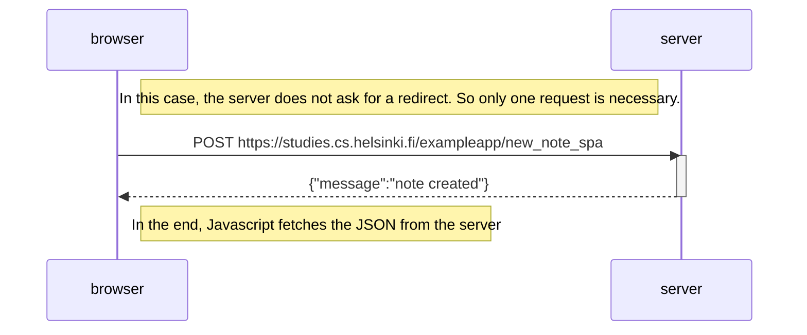

```mermaid
sequenceDiagram
    participant browser
    participant server

    Note right of browser: In this case, the server does not ask for a redirect. So only one request is necessary.

    browser->>server: POST https://studies.cs.helsinki.fi/exampleapp/new_note_spa
    activate server
    server-->>browser: {"message":"note created"}
    deactivate server

    Note right of browser: In the end, Javascript fetches the JSON from the server
```